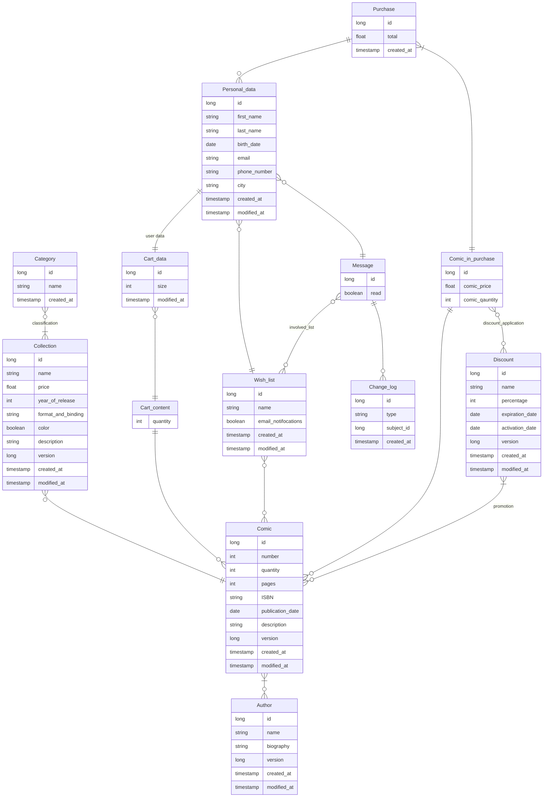

## Schema concettuale

```mermaid
erDiagram

    Category }o--|{ Collection :classification
    Collection }o--|| Comic :""
    Comic }|--o{ Author :""
    Discount }|--o{ Comic :promotion
    Personal_data ||--|| Cart_data :"user data"
    Cart_data }o--|| Cart_content :""
    Cart_content ||--o{ Comic :""
    Personal_data }o--|| Wish_list :""
    Wish_list }o--o{ Comic :""
    Purchase ||--o{ Personal_data :""
    Purchase }|--|| Comic_in_purchase :""
    Comic_in_purchase ||--o{ Comic :""
    Comic_in_purchase }o--o{ Discount :discount_application
    Personal_data }o--|| Message :""
    Message }o--o{ Wish_list :"involved_list"
    Message ||--o{ Change_log :""

    Personal_data {
        long id
        string first_name
        string last_name
        date birth_date
        string email
        string phone_number
        string city
        timestamp created_at
        timestamp modified_at
    }

    Cart_data {
        long id
        int size
        timestamp modified_at
    }

    Collection {
        long id
        string name
        float price
        int year_of_release
        string format_and_binding
        boolean color
        string description
        long version
        timestamp created_at
        timestamp modified_at
    }

    Comic {
        long id
        int number
        int quantity
        int pages
        string ISBN
        date publication_date
        string description
        long version
        timestamp created_at
        timestamp modified_at
    }

    Cart_content {
        int quantity
    }

    Author {
        long id
        string name
        string biography
        long version
        timestamp created_at
        timestamp modified_at
    }

    Wish_list {
        long id
        string name
        boolean email_notifocations
        timestamp created_at
        timestamp modified_at
    }

    Category {
        long id
        string name
        timestamp created_at
    }

    Discount {
        long id
        string name
        int percentage
        date expiration_date
        date activation_date
        long version
        timestamp created_at
        timestamp modified_at
    }

    Purchase {
        long id
        float total
        timestamp created_at
    }

    Comic_in_purchase {
        long id
        float comic_price
        int comic_qauntity
    }

    Change_log {
        long id
        string type
        long subject_id
        timestamp created_at
    }

    Message {
        long id
        boolean read
    }


```
